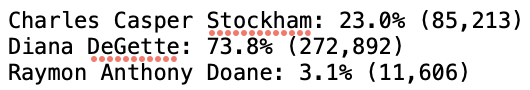

# Election_Analysis

## Project Overview
The Colorado board of elections has tasked us to complete the election audit of a recent local congressional election. Using python and imported csv module, we read the csv file (containing fields: ballot ID, county, and candidate), perform basic anaylses, and write the results to a .txt file.

*Election Audit Objectives, Get:*
1. Total number of votes cast.
2. Complete list of candidates who received votes.
3. Breakdown of each *candidate's number of votes and the percentage of total votes cast.
4. Winner of the election based on popular vote.
5. Breakdown of each *county's number of votes and percentage of total votes cast.
6. County with the largest number of votes.

## Resources
- Data Source: election_results.csv
- Software: Python 3.9.12, Visual Studio Code 1.72.2

## Election Audit Results
* Total Votes Cast: 369,711
* Candidate Breakdown (Name, % of Total Votes, # Votes)

  
  
* Winner Breakdown: 

  
  
* County Summary (Name, % of Total Votes, # Votes)

  
  
* County with Largest Number Votes: Denver
 
## Election Audit Summary
We've succesfully evaluated this local congressional election's data, producing a summary of county and candidates voting results, including: total votes cast, vote count and percentage votes for each county and candidate, winner of the election, county with largest votes. 

This script may be used on past and future election results, as well as other locality or state election data, as long as the data is structured similarly. Though, the script can be modified to accomodate for new columns of data or additional analyses that we are interested in by declaring new variables, creating new loops and decision statements, and new print and write to file statements. For example, if interested in looking at the most popular candidate in each county, create additional varaibles and decision statements to find the candidate that received the highest number of votes in each county. Another way the script can be modified is by writing the results to separate .txt files based on subject (candidate summary, county summary, etc.)
