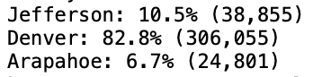

# Election_Analysis

## Project Overview
The Colorado board of elections has tasked us to complete the election audit of a recent local congressional election. Using python and imported csv module, we are able to read the csv file (containing fields: ballot ID, county, and candidate), perform basic anaylses, and write the results to a .txt file.

Election Audit Objectives:
1. Total number of votes cast.
2. Complete list of candidates who received votes.
3. Breakdown of each *candidate's number of votes and the percentage of total votes cast.
4. Winner of the election based on popular vote.
5. Breakdown of each *county's number of votes and percentage of total votes cast.
6. County with the largest number of votes.

## Resources
- Data Source: election_results.csv
- Software: Python 3.9.12, Visual Studio Code 1.72.2

## Election Audit Results
* Total Votes Cast: 369,711
* Candidate Breakdown
  
* Winner Breakdown: 
  
* County Summary
  
* County with Largest Number Votes: Denver
 
## Summary
The findings were that there were total 369,711 votes cast in this election.
The candidates and the percentage and number of votes received were:
- Charles Casper Stockham, who received 23% of the vote and 85,213 number of votes.
- Diana DeGette, who received 73.8% of the vote and 272,892 number of votes.
- Raymon Anthony Doane 3.1% of the votes and 11,606 number of votes.
Diana was the winner of the election. 

## Challenge Overview

## Challenge Summary
